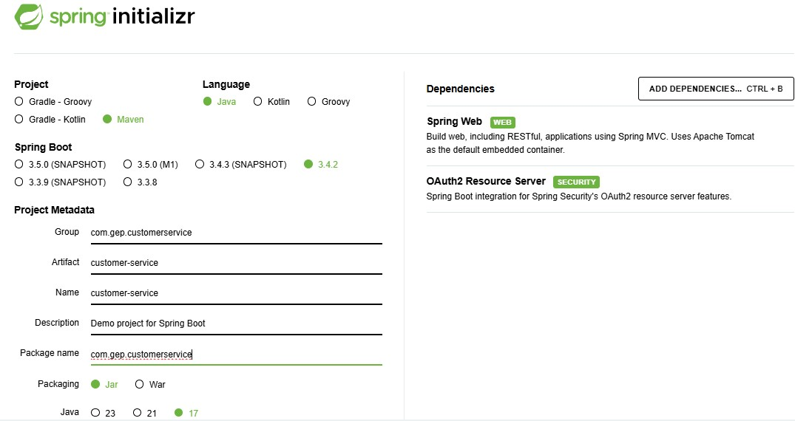

# Proyecto 08: Servicio que consume una API con seguridad basada en OAuth2 y OpenID Connect

Este proyecto tiene como objetivo desarrollar una API que consuma la api seguridad basada en OAuth2 y OpenID Connect. Para ello, se implementará un servidor de autorización OAuth2 con Spring Security. 
Se encargará de validar usando la clave publica para acceso a los recursos protegidos. Para acceder a los recursos definidos en el controlador se requiere que se realice login en el servidor de autorización (aplicacion: security-aouth-jwt) y se obtenga un token de acceso. Para luego agregarlo en el header de la petición. para acceder a los recursos:

<div align="center">
   <h1>Challenge | Java | Back End - SpringBoot | Spring Security Oauth2 - Service-Consumer</h1>
</div>


<p align="center">
  <br>
  

  
</p>

👨🏻‍💻 <strong>Gerson Escobedo Pérez </strong></br>
<a href="https://www.linkedin.com/in/gerson-escobedo/" target="_blank">
</a>


### Imagen de Requerimientos


## Endpoints y la forma de acceder
# Proyecto security-aouth-jwt

Este proyecto implementa autenticación con JWT para proteger recursos. A continuación, se detallan los pasos para obtener un token de acceso y acceder a recursos protegidos.

## Obtener el Token de Acceso
Se requiere levantar el proyecto `security-oauth-jwt` ejecutar la clase main, para obtener el token de acceso. 

Para generar el token de acceso, sigue estos pasos en Postman:

1. Realizar una petición `POST` a:
   ```
   http://localhost:8080/token
   ```
2. En la pestaña **Authorization**, seleccionar **Basic Auth** e ingresar:
   - **Username:** `user1`
   - **Password:** `1234`
3. En la pestaña **Body**, seleccionar **x-www-form-urlencoded** o **form-data** y agregar los siguientes parámetros:

   | Key               | Value       |
      |-------------------|------------|
   | grantType        | password o refreshToken |
   | username        | user1       |
   | password        | 1234        |
   | withRefreshToken | true o false |

4. Si en `grantType` se usa `refreshToken`, se debe agregar un campo adicional:

   | Key          | Value                    |
      |-------------|--------------------------|
   | refreshToken | (pegar el refreshToken generado) |

5. Enviar la petición generará un **token de acceso** y un **token de actualización**.

## Acceder a un Recurso Protegido
Requiere levantar el proyecto `customer-service` ejecutar la clase main, para acceder a los recursos protegidos.
Para acceder al recurso protegido:

1. Realizar una petición `GET` a:
   ```
   http://localhost:8081/customers
   ```
2. En la pestaña **Authorization**, seleccionar **Bearer Token** e ingresar el token de acceso generado.
3. Enviar la petición y se obtendrá la respuesta con los datos del usuario autenticado.

## 🖥️ Tecnologías utilizadas
- ☕ Java 17
- JPA Hibernate
- [Intellij](https://www.jetbrains.com/idea/)
- [MySql](https://www.mysql.com/)
- [Java](https://www.java.com/en/)

## ⚠️ Importante! ⚠️
☕ Usar Java versión 8 o superior para compatibilidad. </br></br>
📝 Recomiendo usar el editor de Intellij</br></br>

## Instalación

1. Clonar el repositorio:
   ```bash
   git clone https://github.com/Gerson121295/SWR-P04-BancaDigital.git
   ```
2. Navegar al directorio del proyecto:
   ```bash
   cd <SWR-P03-Encuestas>
   ```
3. Construir el proyecto con Maven:
   ```bash
   mvn clean install
   ```
4. Ejecutar la aplicación:
   ```bash
   mvn spring-boot:run
   ```


## Notas
- Asegúrate de que el servidor esté activo en `http://localhost:8080` para realizar las peticiones.
- Utiliza herramientas como Postman o cURL para probar los endpoints.
- Los IDs utilizados en los ejemplos son ficticios; reemplázalos por los correspondientes a tu base de datos.

# 💙 Personas Contribuyentes
## Autores
[<br><sub>Gerson Escobedo</sub>](https://github.com/gerson121295)

# Licencia


License: [MIT](License.txt)

